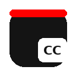

<div align="center">



# YouTube PiP Subtitles

### Subtitles that actually follow your video into Picture-in-Picture.

[](https://www.google.com/chrome/)
[](https://developer.chrome.com/docs/extensions/mv3/)
[](LICENSE)
[]()

<br />

*When you pop a YouTube video into PiP mode, subtitles vanish —*
*they stay behind on the main page, completely useless.*
*This extension fixes that.*

</div>

<br />

## 🎥 Demo
<video src="https://github.com/user-attachments/assets/ee49ce90-aa6f-44d4-b002-e998ea847e54" width="100%" controls></video>

## ⚡ How It Works

YouTube renders captions as HTML overlays on top of the video player. The browser's PiP API only grabs the raw `<video>` element, leaving all HTML behind — including subtitles.

Instead of trying to hijack YouTube's caption DOM, this extension takes a different approach:

```
 ┌─────────────────────────────────────────────────┐
 │  1. Intercept ytInitialPlayerResponse           │
 │  2. Extract timedtext API caption track URLs    │
 │  3. Fetch & parse JSON3 caption data            │
 │  4. Poll video.currentTime at 100ms intervals   │
 │  5. Render synced subtitles in Document PiP     │
 └─────────────────────────────────────────────────┘
```

The result: a **Document Picture-in-Picture** window (Chrome 116+) that can render arbitrary HTML — exactly what subtitle overlays need.

<br />

## ✨ Features

| Feature | Details |
|---|---|
| 🎬 **PiP Subtitles** | Subtitles rendered inside the PiP window, perfectly synced |
| 🌍 **All Languages** | Every language track YouTube offers, including auto-generated |
| 🎨 **Customizable** | Font size, family, text color, background opacity, position |
| 🔄 **SPA Navigation** | Works seamlessly when switching between videos |
| 🛡️ **DOM Fallback** | Falls back to YouTube's DOM captions if API is unavailable |
| ⚡ **Lightweight** | No external dependencies — pure Manifest V3 extension |

<br />

## 📦 Installation

> [!IMPORTANT]
> Requires **Chrome 116** or later. Earlier versions don't support the [Document Picture-in-Picture API](https://developer.chrome.com/docs/web-platform/document-picture-in-picture/).

1. **Clone** or download this repository:
   ```bash
   git clone https://github.com/your-username/youtube-pip-subtitles.git
   ```
2. Open Chrome → navigate to `chrome://extensions`
3. Enable **Developer mode** (top-right toggle)
4. Click **Load unpacked** → select the project folder
5. ✅ The extension is now active on all YouTube pages

<br />

## 🚀 Usage

1. Open any YouTube video
2. Enable subtitles using YouTube's **CC button** and select your language
3. Hover over the video → click the red **▶ PiP + Altyazı** button (top-left)
   *or use the CC icon in the player's bottom-right controls*
4. A PiP window opens with your video — **subtitles appear inside it** 🎉

To close: click the button again or close the PiP window.

<br />

## 🎨 Customization

Click the extension icon in Chrome's toolbar to open the settings panel:

| Setting | Range / Options |
|---|---|
| **Font Size** | `10px` – `32px` slider |
| **Font Family** | Trebuchet MS, Arial, Georgia, Verdana, Courier New, Impact |
| **Text Color** | Full color picker |
| **Background Opacity** | `0%` – `100%` slider |
| **Position** | Bottom / Top toggle |

> [!TIP]
> Settings sync across devices via `chrome.storage.sync` and apply instantly to the active PiP window — no need to restart.

<br />

## 🗂️ Project Structure

```
youtube-pip-subtitles/
├── manifest.json      # Extension manifest (MV3)
├── content.js         # Core logic — caption fetching, PiP window, sync engine
├── content.css        # Styles injected into YouTube pages
├── popup.html         # Settings panel UI
├── popup.js           # Settings panel logic
├── icons/
│   ├── icon16.png
│   ├── icon48.png
│   └── icon128.png
├── LICENSE
└── README.md
```

<br />

## 🔧 Technical Deep Dive

<details>
<summary><b>Why not <code>captureStream()</code>?</b></summary>
<br />

YouTube's media pipeline triggers security restrictions on `captureStream()` for many videos due to CORS and DRM policies. Even when it succeeds, moving the video element breaks YouTube's caption engine entirely. The timedtext API approach sidesteps both issues — captions are fetched independently as data, not DOM elements.

</details>

<details>
<summary><b>Why Document PiP instead of native PiP?</b></summary>
<br />

The native `requestPictureInPicture()` API only supports the raw `<video>` element with zero HTML overlay capability. `documentPictureInPicture.requestWindow()` (Chrome 116+) opens a full browsing context where arbitrary HTML can be rendered — which is exactly what subtitle overlays need.

</details>

<details>
<summary><b>Caption sync accuracy</b></summary>
<br />

Captions are synced every **100ms** against `video.currentTime`. YouTube's JSON3 format provides millisecond-level timing per cue event, so sync is accurate to within one polling interval. The extension uses `setInterval` rather than `requestAnimationFrame` to ensure consistent polling even when the PiP window doesn't have focus.

</details>

<details>
<summary><b>SPA navigation handling</b></summary>
<br />

YouTube is a SPA (Single Page Application) — standard page load events don't fire when navigating between videos. The extension uses a `MutationObserver` on `document.body` to detect URL changes and reinitializes the caption pipeline when a new video is loaded.

</details>

<br />

## 🌐 Browser Compatibility

| Browser | Status | Notes |
|---|---|---|
| Chrome 116+ | ✅ **Full support** | Document PiP API available |
| Edge 116+ | ✅ **Compatible** | Chromium-based, should work |
| Chrome < 116 | ❌ Not supported | Document PiP API unavailable |
| Firefox | ❌ Not supported | No Document PiP API yet |
| Safari | ❌ Not supported | No Document PiP API yet |

<br />

## 🤝 Contributing

Issues and pull requests are welcome! Here are some areas worth exploring:

- 🎬 **Netflix / Prime Video support** — similar approach, different caption format
- 🌐 **In-PiP language switcher** — change subtitle track without leaving PiP
- ⏱️ **Subtitle delay adjustment** — manual offset for out-of-sync cases
- 📝 **Dual subtitles** — show two languages simultaneously
- 📐 **Resizable PiP window** — remember user's preferred window size

<br />

## 📄 License

This project is licensed under the [MIT License](LICENSE) — do whatever you want with it.

---

<div align="center">

<br />

**Built because YouTube should have shipped this years ago.**

<br />

<sub>If you find this useful, consider giving it a ⭐</sub>

</div>
